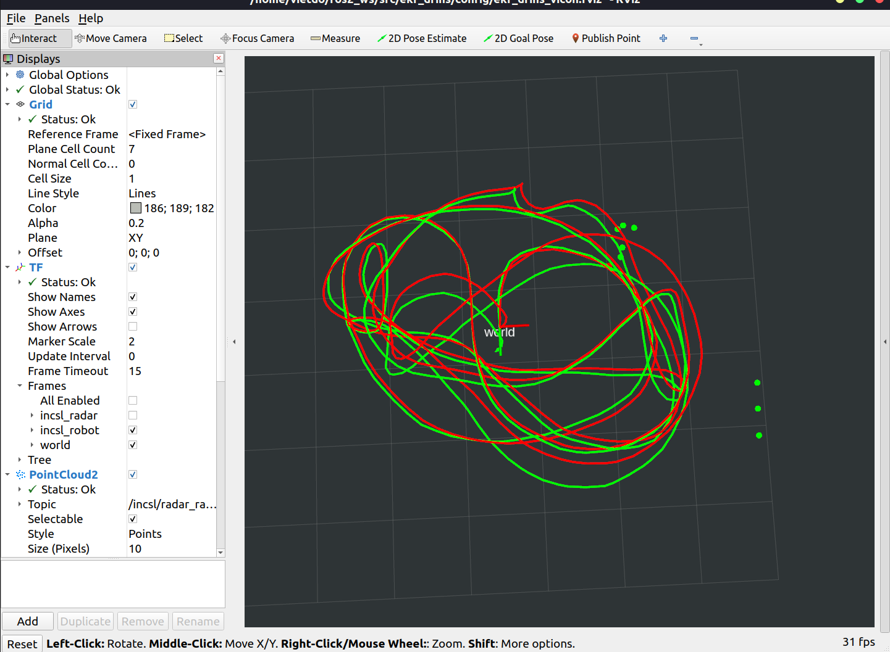
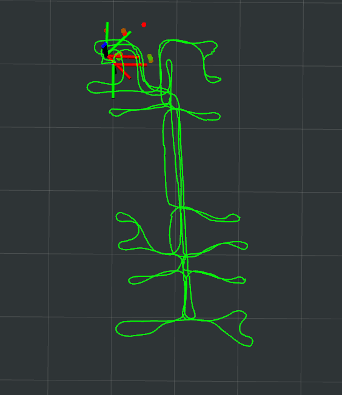

# DeRO
## Dead Reckoning Based on Radar Odometry With Accelerometers Aided for Robot Localization
## News / Events
- **June 30, 2024** - The paper has been accepted for publication in the IROS 2024 as an oral presentation.
- **March 11, 2024** - The manuscript has been online at the [arXiv](https://arxiv.org/abs/2403.05136).
- **March 05, 2024** - Our paper has been submitted to [IROS 2024](https://iros2024-abudhabi.org/).

## 1. Overview
This is a ROS 2 package for DeRO, written in C++. DeRO utilizes 4D point cloud measurements from a millimeter-wave Frequency-Modulated Continuous Wave (FMCW) radar and IMU measurements to estimate the robot's poses. Specifically, Doppler velocity and gyroscope measurements are used to calculate odometry, while the radar's range and accelerometer measurements are utilized to update the estimation using a Stochastic Cloning Extended Kalman Filter (SCEKF).

  

## 2. Prerequisites
- Ubuntu 20.04.
- [ROS2 Foxy](https://docs.ros.org/en/foxy/Installation.html).
- Open-source datasets for reproducing the paper's results can be downloaded from [here](https://christopherdoer.github.io/datasets/icins_2021_radar_inertial_odometry).
- This package was tested with ```C++14```, ```PCL 1.10.0```, and ```Eigen 3.3.7```.

## 3. Build
- Clone the repository and build:
```cmd
mkdir -p ~/ros2_ws/src
cd ~/ros2_ws/src
git clone https://github.com/hoangvietdo/dero
cd ..
colcon build
```

Note: There will be some warnings, but just ignore them.

## 4. Run
- Choose the dataset you want to run on (e.g., Carried 1, Carried 2, etc.) and convert the ROS1 bag to ROS2 bag using ```rosbags-convert```.
- Change the value of ```est_save_dir``` and ```bag_dir``` in the corresponding launch file (e.g., ```dero_carried_1_ros2bag.launch.py``` (proposed method) or ```rio_carried_1_ros2bag.launch.py``` (compared method))
- In 1st terminal: Execute the launch file
  ```cmd
  ros2 launch dero dero_carried_1_ros2bag.launch.py
  ```
- In 2nd terminal: Open the rviz config file ```config/dero_carried_1.rviz``` using
  ```cmd
  rviz2
  ```

## 5. Evaluation
- We use a modified version of [rpg_trajectory_evaluation](https://github.com/hoangvietdo/rpg_trajectory_evaluation) for verifying the filter's performances.
- By default, the .txt file generated from ```est_save_dir``` is already compatible with the aforementioned toolbox.
- The pseudo-ground truth is given in ```results/carried_datasets/laptop/```.

## 6. Credit / Acknowledgements
- This code was written at the [Intelligent Navigation and Control Systems Laboratory](https://sites.google.com/view/incsl), Sejong University, Seoul, Republic of Korea.
- Some parts of the code are referenced from [REVE](https://github.com/christopherdoer/reve), [EKF-RIO](https://github.com/christopherdoer/rio/tree/main/ekf_rio), and [EnVIO](https://github.com/lastflowers/envio).
- This work was supported by the Unmanned Vehicles Core Technology Research and Development Program through the National Research Foundation of Korea (NRF), Unmanned Vehicle Advanced Research Center (UVARC) funded by the Ministry of Science and ICT, the Republic of Korea (No. 2020M3C1C1A01086408 and NRF-2023M3C1C1A01098408).

## 7. Citation
If you find this work beneficial to your academic research, we would greatly appreciate it if you could reference our paper in your citations.
```bibtex
@misc{do2024dero,
      title={DeRO: Dead Reckoning Based on Radar Odometry With Accelerometers Aided for Robot Localization}, 
      author={Hoang Viet Do and Yong Hun Kim and Joo Han Lee and Min Ho Lee and Jin Woo Song},
      year={2024},
      eprint={2403.05136},
      archivePrefix={arXiv},
      primaryClass={cs.RO}
}
```

## 8. License
Our source code is released under the [GPLv3](https://www.gnu.org/licenses/gpl-3.0.en.html) license. If there are any issues in our source code please contact the author [hoangvietdo@sju.ac.kr](mailto:hoangvietdo@sju.ac.kr).
